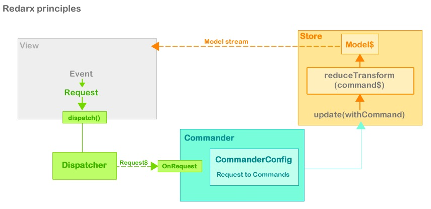

# Unstart

(Experimental) Unidirectional data-flow State management for Dart 
humbly inspired by [ngrx](https://github.com/ngrx) <= [Redux](http://redux.js.org) <= [Elm](http://elm-lang.org/), [André Stalz work](https://github.com/staltz) & [Parsley](http://www.spicefactory.org/parsley/).



## Examples

- [Redarx with Flutter example](https://github.com/rxlabz/redarx_flutter_example) (uses [built_value])
- [Redarx with AngularDart example](https://github.com/rxlabz/redarx-angular-example)
- [Redarx with Vanilla Dart example](https://github.com/rxlabz/redarx-todo)


## Principles

### Requests to Commands Mapping via CommanderConfig

Goal : decouple request from action. View only dispatch dumb requests, the logic to execute the request is delegated to a command.

```dart
final requestMap =
    <RequestType, CommandBuilder<TodoModel>>{
  RequestType.ADD_TODO: AddTodoCommand.constructor(),
  RequestType.UPDATE_TODO: UpdateTodoCommand.constructor(),
  RequestType.CLEAR_ARCHIVES: ClearArchivesCommand.constructor(),
  RequestType.COMPLETE_ALL: CompleteAllCommand.constructor(),
  RequestType.LOAD_ALL: AsyncLoadAllCommand.constructor(DATA_PATH),
  RequestType.TOGGLE_SHOW_COMPLETED: ToggleShowArchivesCommand.constructor()
};
```

### Initialization

```dart
final config = new CommanderConfig<RequestType>(requestMap);
final store = new Store<TodoModel>(() => new TodoModel.empty());
final dispatcher = new Dispatcher();

final cmder = new Commander(config, store, dispatcher.onRequest);
```

*Flutter*
```dart
final requestMap = <RequestType, CommandBuilder>{
  RequestType.LOAD_ALL: AsyncLoadAllCommand.constructor(DATA_PATH),
  RequestType.ADD_TODO: AddTodoCommand.constructor(),
  RequestType.UPDATE_TODO: UpdateTodoCommand.constructor(),
  RequestType.CLEAR_ARCHIVES: ClearArchivesCommand.constructor(),
  RequestType.COMPLETE_ALL: CompleteAllCommand.constructor(),
  RequestType.TOGGLE_SHOW_COMPLETED: ToggleShowArchivesCommand.constructor()
};

void main() {
  final cfg = new CommanderConfig<RequestType, TodoModel>(requestMap);
  final store =
      new Store<Command<TodoModel>, TodoModel>(() => new TodoModel.empty());
  final dispatcher = new Dispatcher();

  new Commander<Command<TodoModel>, TodoModel>(
      cfg, store, dispatcher.request$);

  runApp(new TodoApp(dispatcher.dispatch, store.state$));
}
```

*Vanilla Dart*
```dart
var app = new AppComponent(querySelector('#app') )
..model$ = store.data$
..dispatch = dispatcher.dispatch
..render();
```

### Dispatching requests

RequestType are defined via an enum

```dart
enum RequestType {
  ADD_TODO,
  UPDATE_TODO,
  ARCHIVE,
  CLEAR_ARCHIVES,
  TOGGLE_SHOW_COMPLETED
}

// you can enforce the typing by creating an optionnal request class
class TodoRequest<T extends Todo> extends Request<RequestType, T> {
  TodoRequest.loadAll() : super(RequestType.LOAD_ALL);
  TodoRequest.clearArchives() : super(RequestType.CLEAR_ARCHIVES);
  TodoRequest.completeAll() : super(RequestType.COMPLETE_ALL);
  TodoRequest.toggleStatusFilter() : super(RequestType.TOGGLE_SHOW_COMPLETED);
  TodoRequest.add(T todo) : super(RequestType.ADD_TODO, withData: todo);
  TodoRequest.cancel(T todo) : super(RequestType.CANCEL_TODO, withData: todo);
  TodoRequest.update(T todo) : super(RequestType.UPDATE_TODO, withData: todo);
}

```

Requests are defined by a type and an optional payload.

```dart
dispatch( new TodoRequest.add(new Todo(fldTodo.value)));
```

or
```dart

```

### Commands

Requests are mapped to commands by Commander and passed to the store.update()

```dart
exec(Request a) {
    store.update(config[a.type](a.payload));
  }
```

The commands define a public exec method which receive the currentState and return the new one.

```dart
class AddTodoCommand extends Command<TodoModel> {
  Todo todo;

  AddTodoCommand(this.todo);

  @override
  TodoModel exec(TodoModel model) => model..items.add(todo);

  static CommandBuilder constructor() {
    return (Todo todo) => new AddTodoCommand(todo);
  }
}
```

### Async Commands

Async commands allows async evaluation of the new state 

### Store

Basically a `(stream<Command<Model>>) => stream<Model>` transformer

Receives new commands, and executes those with the current state/Model

Use a `CommandStreamReducer<S extends Command, T extends AbstractModel>` to stream reduced states

The store manage a stream of immutable states instances. 

### Reversible Store

The reversible store keep a history list of all executed commands and allow cancelling.

it provide an access to currentState by reducing all the commands history. 

### State listening

The store exposes a stream of immutable states

```dart
Stream<TodoModel> _model$;

set model$(Stream<TodoModel> value) {
_model$ = value;
    
modelSub = _model$.listen((TodoModel model) {
      list.todos = model.todos;
      footer.numCompleted = model.numCompleted;
      footer.numRemaining = model.numRemaining;
      footer.showCompleted = model.showCompleted;
    });
  }
```

### Experimental multi-channel dispatcher (0.6.0)
 
Async commands are maybe not the best way to connect a Firebase data-source.
 
The [redarx_ng_firebase](https://github.com/rxlabz/redarx_ng_firebase) example shows a way to dispatch firebase queries via a new dispatcher method : query.
 
Queries are dispatched to a Firebase service, which update the base.
The service handles firebase.database child and values events and dispatch update request via the dispatch() method. 

## Event$ » Request$ » Command$ » state$ 

The Application State is managed in a Store<T extends AbstractModel>.

State is updated by commands, and the store keep a list of executed commands.

State is evaluated by commands updates,

In reversible-store, cancellation is allowed by simply remove the last command from "history".

A Commander listen to a stream of Requests dispatched by a Dispatcher injected in the application components | controllers | PM | VM

Each Request is defined by an RequestType enum, and can contains data.

Requests are "converted" to commands by the Commander, based on the CommanderConfig.map definition  

- the dispatcher.dispatch function is injected in view || controller || PresentationModel || ViewModel  
- Request are categorized by types, types are defined in RequestType enum
- the dispatcher stream Requests
- the dispatcher requestStream is injected in Commander, the commander listen to it,
transforms Request to Command and transfer to the store.apply( command ) method

- each Request is tied to a command via a CommanderConfig which is injected in Commander

```dart
// instanciate commands form requests 
config[request.type](request.payload);
```

- Commander need a CommanderConfig containing a Map<RequestType,CommandBuilder>
- the store then execute commandHistory and push the new model value to a model stream


## TODO 

- ~~fix the generic/command ( <T extends Model> mess)~~
- ~~implements a Scan stream transformer » to allow only run the last commands & emit the last reduced state~~
- ~~async commands~~
- ~~test Angular integration~~
- ~~test with Firebase~~
- ~~typed Request ? BookRequest, UserRequest ...? => TodoRequest cf. flutter example~~
- use values types [cf built_value](https://github.com/google/built_value.dart)
- multiple stores ?
- time travel / history UI

- tests
- external config file ? 
- ...

## Doubts

- use a EnumClass implementation rather than dart enum type
- dispatcher : use a streamController.add rather than dispatch method ?
- multiple store ? dispatcher ? commander ?
- each component could set an Request stream and the commander could maybe listen to it

## Goals

- study Dart : streams, generics, annotations, asynchrony...
- study Redux & ngrx, play with reducers & Request/Commands mapping...
- and more studies, more experiments, more play...
- define a solid architecture for my coming projects
