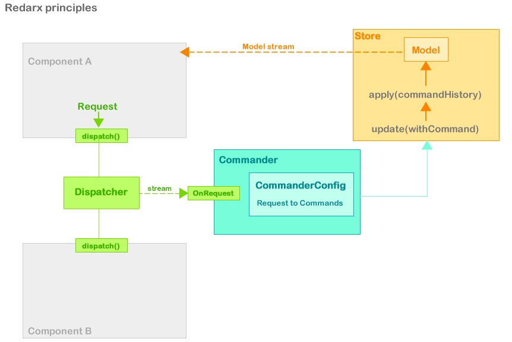

# Redarx (POC)

Experimental Dart State Management 
humbly inspired by [Parsley](http://www.spicefactory.org/parsley/) / [Redux](http://redux.js.org) / [ngrx](https://github.com/ngrx) and [André Stalz work](https://github.com/staltz)



## [Demo](https://github.com/rxlabz/redarx-todo) / [Dart doc](https://rxlabz.github.io/redarx)

## Goals

- study Dart : streams, generics, annotations, asynchrony...
- study Redux, Mobx,  state management
- play with reducers, Request/Commands mapping...
- and more studies, more experiments, more play...

## Principles

The Application State is managed in a Store<AbstractModel>.

State is updated by commands, and the store keep a list of executed commands.

State is evaluated by a reducers of model commands updates, basic cancellation is allowed by simply remove the last command from "history".

A Commander listen to a stream of Requests dispatched by a Dispatcher injected in the application components | controllers | PM | VM

Each Request is defined by an RequestType enum, and can contains data.

Requests are "converted" to commands by the Commander, based on the CommanderConfig.map definition  

- the dispatcher.dispatch function is injected in view || controller || PresentationModel || ViewModel  
- Request are categorized by types, types are defined in RequestType enum
- the dispatcher stream Requests
- the dispatcher requestStream is injected in Commander, the commander listen to it,
transforms Request to Command and transfer to the store.apply( command ) method

- each Request is tied to a command via a CommanderConfig which is injected in Commander

```dart
// instanciate commands form requests 
config[request.type](request.payload);
```

- Commander need a CommanderConfig containing a Map<RequestType,CommandBuilder>
- the store then execute commandHistory and push the new model value to a model stream

## TODO 

- ~~fix the generic/command ( <T extends Model> mess)~~
- **implements a Scan stream transformer » to allow only run the last commands & emit the last reduced state**
- typed Request ? BookRequest, UserRequest ...?
- async commands 
- external config file ? dynamic runtime RequestType/Command Pair via defered libraries loading ?
- ...

## Questionning

- dispatcher : use a streamController.add rather than dispatch method ?
- multiple store ? dispatcher ? commander ?
- each component could set an Request stream and the commander could maybe listen to it
