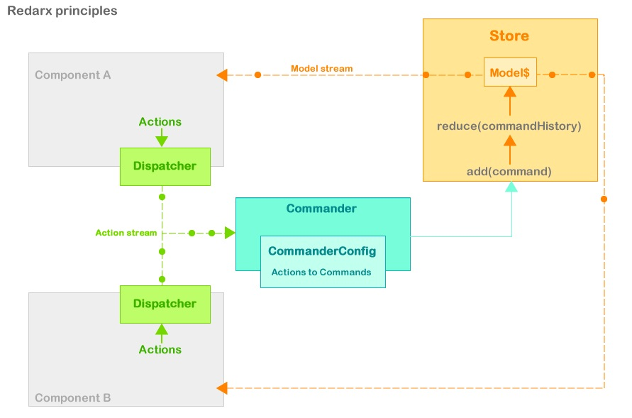

# Redarx

Dart State Management (POC)
inspired by [Parsley](http://www.spicefactory.org/parsley/) / [Redux](http://redux.js.org) / [ngrx](https://github.com/ngrx) 

## Goals

- study Dart : streams, generics, annotations, asynchrony...
- study Redux state management
- study  command pattern 
- experiment an Action/Commands pairing
- study X,...
- experiment Y,...

## Usage

## Principles

The Application State is managed by a (Generic)Store.

State is updated by commands, and the store keep a list of executed commands.

State is evaluated by a reducers of model commands updates, basic cancellation is allowed by simply remove the last command from "history".

A Commander listen to a stream of Actions dispatched by a Dispatcher injected in the applicaiton components | controllers | PM | VM

Each action is defined by an ActionType, and can contains data. Actions are linked / tied to commandes 

- the dispatcher is injected in view || controller || PresentationModel || ViewModel  
- Controllers use the dispatcher to dispatches send Action actions
- Action are categorized by types, types are defined in ActionTypes
- the dispatcher stream dispatched actions
- the dispatcher is injected in Commander
- the commander listen the actions stream
- each action is tied to a command via a CommanderConfig which is injected in Commander
- Commander need a CommanderConfig containing a Map<ActionType,Command>
- when an action is dispatched, the commander add the corresponding command to the store
- the store then execute 
- a (synchronous) command is executed to update the store
- the store is injected in the commander

## TODO 

- implements a Scan stream transformer 
- async commands 
- external config file ? dynamic runtime ActionType/Command Pair via defered libraries loading ?

## Questionning

- typed Action ? BookAction, UserAction ...?
- multiple store ? dispatcher ? commander ?